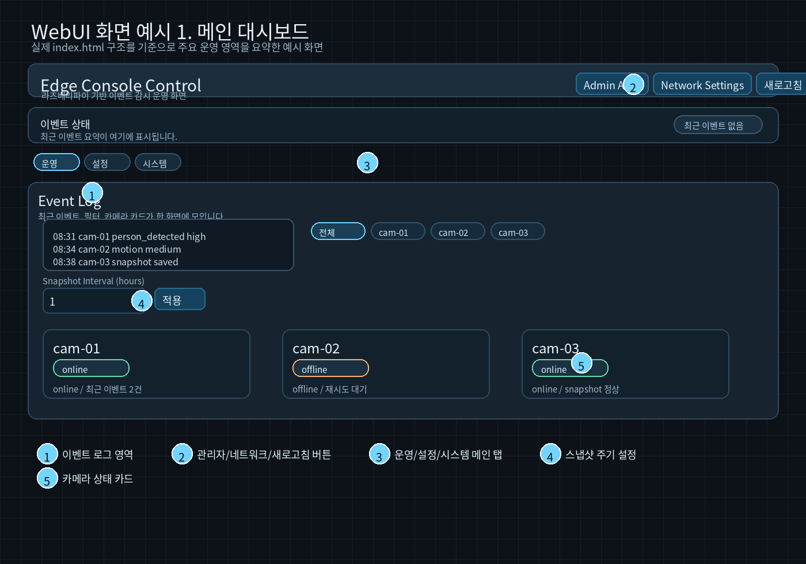
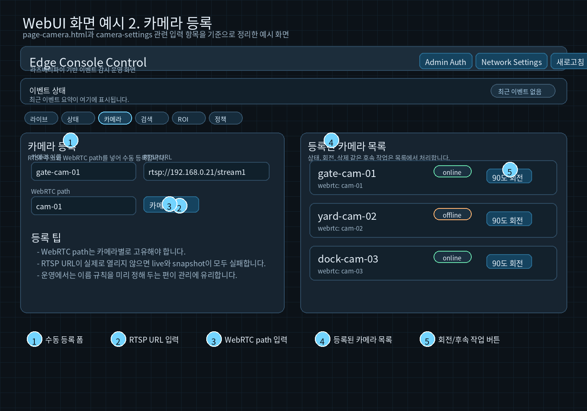
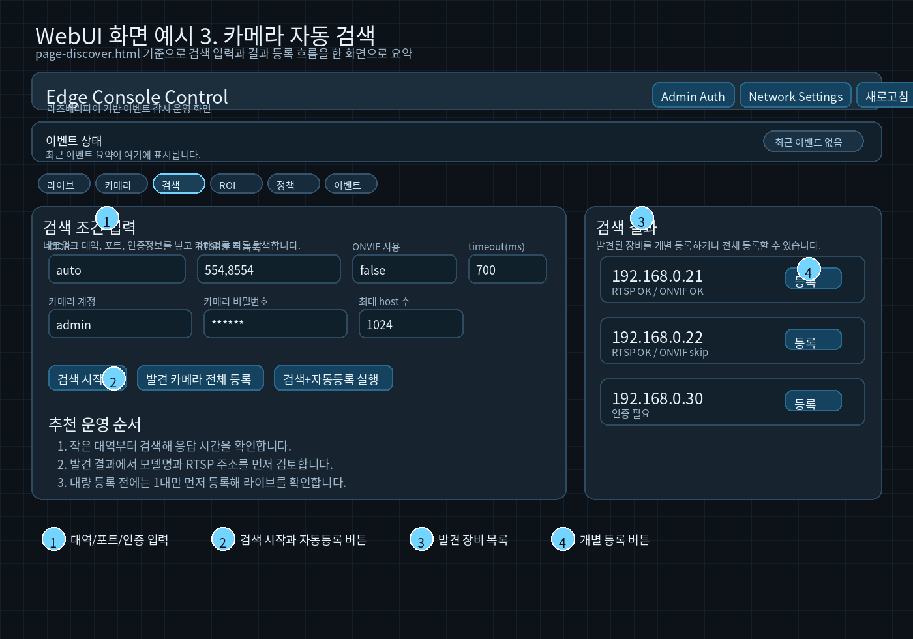
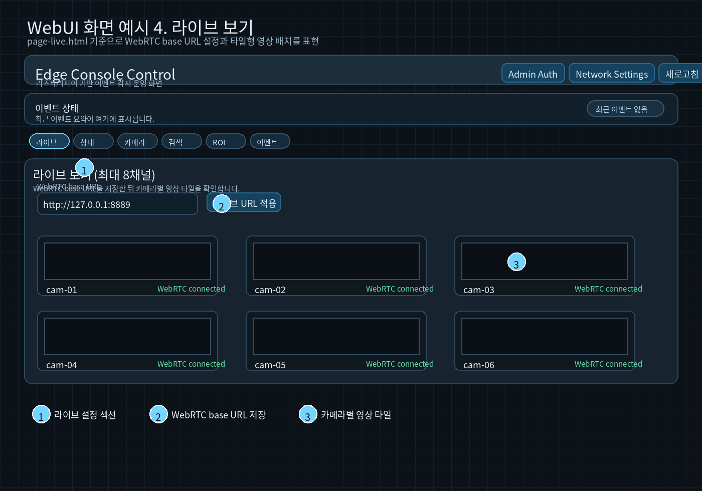
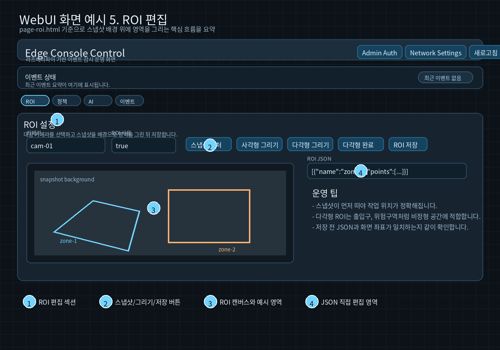
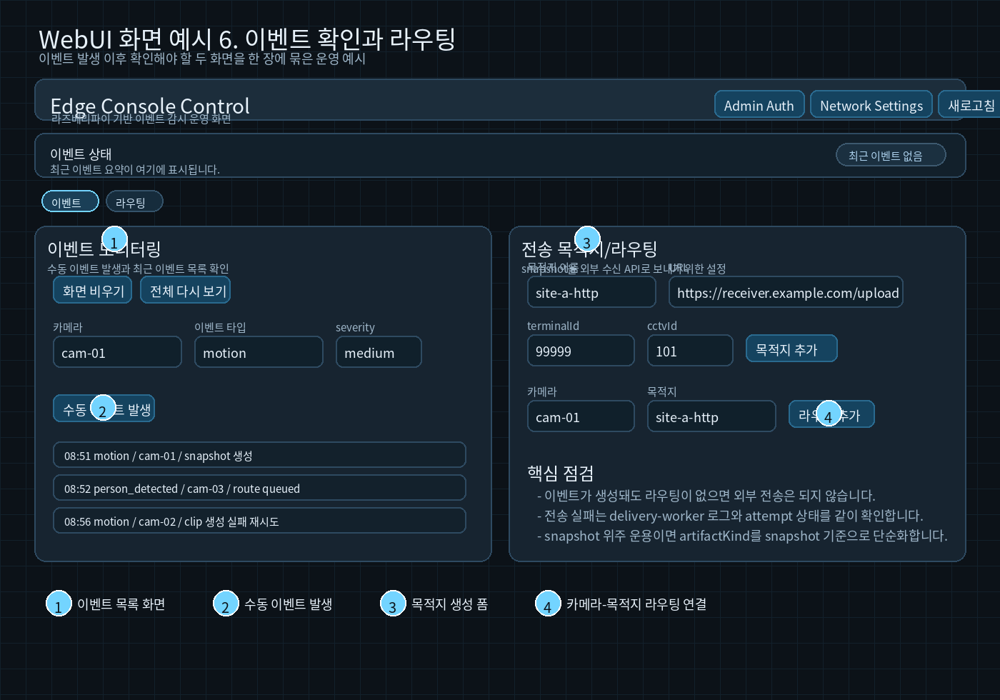

# VMS Web UI 운영 매뉴얼

작성일: 2026-03-10  
대상 시스템: `vms-8ch-webrtc`

## 1. 문서 목적

이 문서는 `services/api/app/static/`의 실제 Web UI 소스와 버튼명, 입력 필드, 운영 흐름을 기준으로 다시 정리한 운영 매뉴얼입니다.

중요:

- 아래 이미지는 현재 작업 공간에서 런타임 WebUI를 직접 캡처한 화면이 아니라, 실제 HTML/CSS 구조와 필드명을 기준으로 만든 소스 기반 화면 예시입니다.
- 따라서 운영자는 이 문서를 "화면 위치를 빠르게 찾는 가이드"로 사용하고, 실제 값은 현장 환경에 맞게 입력하면 됩니다.
- 이미지 파일은 `docs/webui-screenshots/`에 함께 저장되어 있습니다.

## 2. 먼저 알아둘 것

기본 접속 주소:

- `http://127.0.0.1:8080/`

관련 서비스:

- API/UI: `vms-api`
- WebRTC: 기본 `http://127.0.0.1:8889`

접속 직후 최소 확인:

1. `deploy/docker-compose.yml` 기준 컨테이너가 모두 올라왔는지 확인합니다.
2. `http://127.0.0.1:8080/healthz`가 `{"ok":true}`를 반환하는지 확인합니다.
3. 라이브 화면이 비어 있으면 MediaMTX와 카메라 RTSP 연결부터 확인합니다.

## 3. 운영자가 보는 첫 화면



이 화면에서 먼저 볼 항목은 아래 5개입니다.

1. 이벤트 로그
2. 상단 관리 버튼
3. `운영 / 설정 / 시스템` 메인 탭
4. 스냅샷 주기 설정
5. 카메라 상태 카드

화면 해석:

- `운영`
  이벤트 로그, 스냅샷 주기, 카메라 카드처럼 실시간 운영에 가까운 영역입니다.
- `설정`
  카메라, ROI, 정책, 라우팅, AI처럼 동작 조건을 바꾸는 영역입니다.
- `시스템`
  라이브, AI 디버그, 인증처럼 점검이나 시스템성 기능에 가깝습니다.

처음 접속했을 때 추천 순서:

1. 카메라 상태 카드에서 online/offline을 봅니다.
2. 이벤트 로그가 최근 시각으로 갱신되는지 봅니다.
3. 필요 시 `새로고침`으로 즉시 재조회합니다.
4. 설정을 바꿔야 하면 `설정` 탭으로 이동합니다.

## 4. 가장 자주 쓰는 화면별 설명

### 4.1 카메라 등록



주요 위치:

1. 수동 등록 폼
2. `RTSP URL` 입력
3. `WebRTC path` 입력
4. 등록된 카메라 목록
5. 회전 같은 후속 작업 버튼

등록 절차:

1. `카메라 이름`을 입력합니다.
2. 실제 연결 가능한 `rtsp://...` 주소를 넣습니다.
3. 카메라별로 고유한 `WebRTC path`를 입력합니다.
4. `카메라 추가`를 누릅니다.
5. 오른쪽 목록에 등록 결과가 보이는지 확인합니다.

운영 팁:

- `WebRTC path`가 중복되면 라이브 확인 단계에서 혼선이 생깁니다.
- RTSP URL이 틀리면 라이브, 스냅샷, 이벤트 처리 모두 연쇄적으로 실패합니다.
- 등록 후에는 바로 라이브 화면으로 이동해 영상이 보이는지 먼저 확인하는 편이 안전합니다.

### 4.2 카메라 자동 검색



주요 위치:

1. 대역, 포트, 인증 입력
2. `검색 시작`과 자동등록 버튼
3. 발견 장비 목록
4. 개별 등록 버튼

권장 절차:

1. `CIDR`은 처음엔 작은 범위로 넣습니다.
2. `RTSP 포트 목록`은 보통 `554` 또는 `554,8554`부터 시작합니다.
3. 인증이 필요한 카메라면 계정과 비밀번호를 같이 넣습니다.
4. `검색 시작` 후 결과 목록을 봅니다.
5. 대량 등록 전에는 한 대만 먼저 `등록`해서 라이브가 되는지 검증합니다.

언제 쓰는가:

- 설치 직후 네트워크에 카메라가 여러 대 붙어 있을 때
- RTSP 주소를 일일이 모를 때
- 카메라 IP 변경 후 다시 수집해야 할 때

### 4.3 라이브 보기



주요 위치:

1. 라이브 섹션
2. `WebRTC base URL` 저장
3. 카메라별 영상 타일

사용 절차:

1. `WebRTC base URL`이 실제 MediaMTX 주소와 맞는지 확인합니다.
2. `라이브 URL 적용`을 눌러 브라우저 쪽 기준 URL을 저장합니다.
3. 영상 타일이 뜨는지 확인합니다.

라이브가 안 보일 때 우선 점검:

1. RTSP URL이 실제로 열리는지
2. WebRTC path 오타가 없는지
3. MediaMTX 포트 `8889`가 정상 노출되는지
4. 브라우저 네트워크 제한이 없는지

### 4.4 ROI 설정



주요 위치:

1. ROI 편집 섹션
2. `스냅샷 캡처`, 그리기, 저장 버튼
3. ROI 캔버스
4. JSON 직접 편집 영역

권장 절차:

1. 대상 카메라를 고릅니다.
2. `스냅샷 캡처`로 배경 이미지를 먼저 가져옵니다.
3. `사각형 그리기` 또는 `다각형 그리기`를 선택합니다.
4. 실제 감지하고 싶은 구역만 표시합니다.
5. 필요하면 오른쪽 JSON을 함께 확인합니다.
6. `ROI 저장`으로 반영합니다.

운영 팁:

- ROI는 너무 넓으면 오탐이 늘고, 너무 좁으면 이벤트가 안 생깁니다.
- 출입구나 위험구역처럼 비정형 공간은 다각형이 더 적합합니다.
- ROI 변경 후에는 수동 이벤트나 AI preview로 반드시 한 번 검증합니다.

### 4.5 이벤트 확인과 외부 전송



왼쪽은 이벤트 확인 화면, 오른쪽은 목적지/라우팅 화면 예시입니다.

이벤트 화면에서 하는 일:

1. 수동 이벤트 발생
2. 최근 이벤트 목록 확인
3. 현재 시점 이후 이벤트만 보기

라우팅 화면에서 하는 일:

1. 목적지 생성
2. 카메라와 목적지 연결
3. snapshot 전송 대상 구성

중요:

- 이벤트가 생성돼도 라우팅이 없으면 외부 전송은 발생하지 않습니다.
- snapshot 중심 운영이면 라우팅도 snapshot 기준으로 단순하게 유지하는 편이 관리가 쉽습니다.
- 전송 실패는 UI만 보지 말고 `delivery-worker` 로그와 함께 확인해야 합니다.

## 5. 실제 운영 흐름

### 5.1 새 카메라 1대 추가

1. `카메라 등록` 또는 `카메라 자동 검색`으로 카메라를 넣습니다.
2. `라이브 보기`에서 영상이 열리는지 확인합니다.
3. `ROI 설정`에서 감지 구역을 잡습니다.
4. `이벤트 정책`에서 `clip` 또는 `snapshot` 모드를 정합니다.
5. 필요하면 `AI 모델`과 `이벤트 팩`을 붙입니다.
6. `수동 이벤트 발생` 또는 AI preview로 동작을 확인합니다.
7. 외부 전송이 필요하면 목적지와 라우팅을 연결합니다.

### 5.2 이벤트가 안 생길 때

1. 카메라 상태가 `online`인지 확인합니다.
2. 라이브 화면에서 영상이 실제로 나오는지 확인합니다.
3. AI 사용 카메라라면 모델 경로와 enable 상태를 확인합니다.
4. ROI가 필요한 영역을 너무 과하게 막고 있지 않은지 봅니다.
5. 이벤트 정책과 이벤트 팩이 활성화돼 있는지 확인합니다.
6. `AI Debug` 또는 수동 이벤트로 기본 동작부터 쪼개서 확인합니다.

### 5.3 스냅샷은 생기는데 전송이 안 될 때

1. 목적지 URL이 맞는지 확인합니다.
2. `terminalId`, `cctvId` 또는 카메라별 매핑이 맞는지 확인합니다.
3. bearer token 환경변수명이 맞는지 확인합니다.
4. 라우팅이 해당 카메라에 실제로 연결됐는지 확인합니다.
5. `delivery-worker` 로그에서 실패 이유를 확인합니다.

## 6. 화면과 파일의 대응

자주 보는 페이지:

- `index.html`
  통합 메인 화면
- `page-camera.html`
  카메라 등록/관리 중심
- `page-discover.html`
  자동 검색 중심
- `page-live.html`
  라이브 중심
- `page-roi.html`
  ROI 편집 중심
- `page-policy.html`
  이벤트 정책 중심
- `page-route.html`
  목적지/라우팅 중심
- `page-ai.html`
  AI/모델 설정 중심
- `page-ai-debug.html`
  개발/점검용 AI 미리보기
- `page-event.html`
  이벤트 확인과 수동 이벤트 생성

운영자가 기억하면 좋은 버튼:

- `새로고침`
  전체 상태 재조회
- `카메라 추가`
  수동 등록
- `검색 시작`
  자동 검색
- `라이브 URL 적용`
  브라우저 WebRTC 기준 주소 저장
- `스냅샷 캡처`
  ROI 배경 확보
- `ROI 저장`
  ROI 반영
- `수동 이벤트 발생`
  이벤트 체인 테스트
- `목적지 추가`
  외부 수신처 생성
- `라우팅 추가`
  카메라와 목적지 연결

## 7. 빠른 점검 명령

```bash
cd /media/fishduke/06800C3B800C3429/WorkWithCodex/vms-8ch-webrtc
docker compose -f deploy/docker-compose.yml --env-file deploy/.env ps
curl http://127.0.0.1:8080/healthz
docker logs vms-api --tail 200
docker logs vms-event-recorder --tail 200
docker logs vms-delivery-worker --tail 200
docker logs vms-mediamtx --tail 200
```

## 8. 문서 보강 메모

현재 매뉴얼은 "실제 소스 기준 화면 예시"를 포함하는 버전입니다. 나중에 운영 환경에서 브라우저 실캡처를 추가할 수 있으면, 아래 이미지 파일만 교체해도 문서 구조는 그대로 유지할 수 있습니다.

- `docs/webui-screenshots/dashboard-overview.png`
- `docs/webui-screenshots/camera-register.png`
- `docs/webui-screenshots/discover-flow.png`
- `docs/webui-screenshots/live-view.png`
- `docs/webui-screenshots/roi-editor.png`
- `docs/webui-screenshots/event-route.png`
