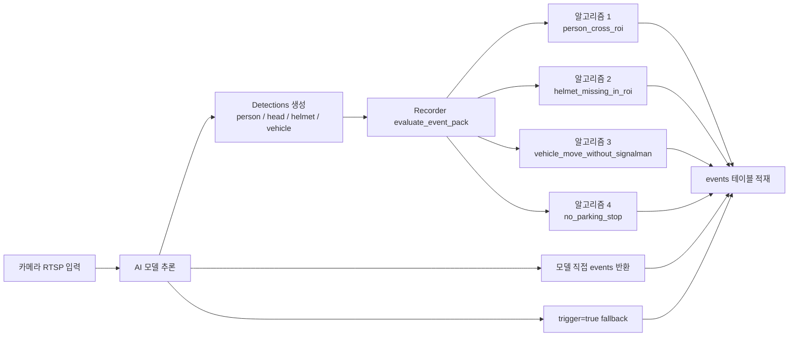
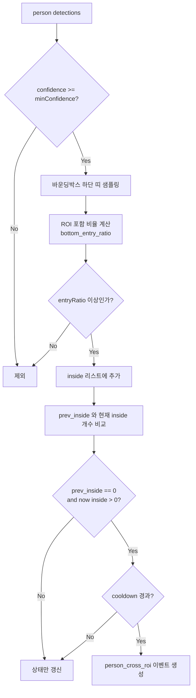
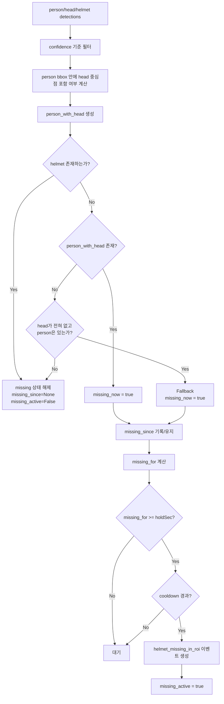
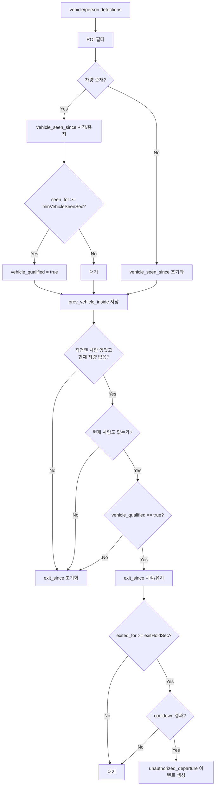
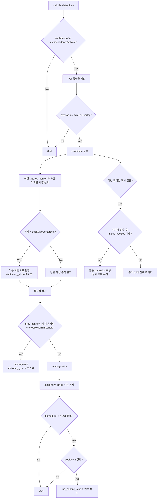

# VMS Edge Basic 4개 이벤트 발생 알고리즘 설명 자료

이 문서는 VMS의 `edge-basic@1.0.0` 이벤트 팩에 포함된 4가지 이벤트 발생 알고리즘을 운영자와 개발자가 함께 이해할 수 있도록 도식화한 자료입니다.

대상 알고리즘:

1. 사람 ROI 진입
2. 헬멧 미착용
3. 신호수 없는 차량 이탈
4. 불법 주정차 정지

기준 코드:

- `config/event_packs/edge-basic@1.0.0.json`
- `services/recorder/worker.py`

문서 목적:

- 어떤 입력이 들어와서 어떤 상태값이 쌓인 뒤 이벤트가 발생하는지 설명
- 단순 탐지 결과와 최종 이벤트 발생의 차이를 설명
- 현장 튜닝 시 어떤 파라미터가 민감한지 빠르게 파악할 수 있게 정리

## 1. 한눈에 보는 전체 구조

핵심 해석:

- AI 모델은 주로 `detection` 목록을 공급합니다.
- 최종 이벤트 발생 여부는 `services/recorder/worker.py`의 `evaluate_event_pack()`에서 결정됩니다.
- 즉, "탐지가 있었다"와 "이벤트가 발생했다"는 같은 의미가 아닙니다.

## 2. 4개 알고리즘 요약표

| 알고리즘 | 이벤트 타입 | 주 입력 객체 | 시간 조건 | 상태 변수 핵심 | 운영 의미 |
|---|---|---|---|---|---|
| 사람 ROI 진입 | `person_cross_roi` | `person` | 없음, 단 전이 조건 사용 | `prev_inside` | ROI 밖에서 안으로 들어오는 순간 1회 감지 |
| 헬멧 미착용 | `helmet_missing_in_roi` | `person`, `head`, `helmet` | `holdSec` 연속 유지 | `missing_since`, `missing_active` | 사람은 있는데 헬멧이 안 보이는 상태가 일정 시간 지속 |
| 신호수 없는 차량 이탈 | `unauthorized_departure` | `vehicle`, `person` | `minVehicleSeenSec`, `exitHoldSec` | `vehicle_seen_since`, `vehicle_qualified`, `exit_since`, `prev_vehicle_inside` | 충분히 있던 차량이 사라졌고 동시에 사람도 없을 때 발생 |
| 불법 주정차 정지 | `no_parking_stop` | `vehicle` | `dwellSec` 정지 유지 | `tracked_center`, `prev_center`, `stationary_since`, `last_seen_at` | 같은 차량이 ROI 안에서 거의 움직이지 않고 오래 머묾 |

## 3. 이벤트 팩 파라미터

| 규칙 키 | 이벤트 타입 | 주요 파라미터 |
|---|---|---|
| `person_cross_roi` | `person_cross_roi` | `roiName`, `minConfidence`, `entryRatio`, `cooldownSec` |
| `helmet_missing_in_roi` | `helmet_missing_in_roi` | `roiName`, `minConfidencePerson`, `minConfidenceHead`, `minConfidenceHelmet`, `holdSec`, `cooldownSec` |
| `vehicle_move_without_signalman` | `unauthorized_departure` | `vehicleRoiName`, `personRoiName`, `minConfidenceVehicle`, `minVehicleSeenSec`, `exitHoldSec`, `cooldownSec` |
| `no_parking_stop` | `no_parking_stop` | `roiName`, `minConfidenceVehicle`, `minRoiOverlap`, `stopMotionThreshold`, `dwellSec`, `missGraceSec`, `trackMaxCenterDist`, `cooldownSec` |

## 4. 알고리즘 1: 사람 ROI 진입 판정

목적:

- 사람이 ROI 안으로 실제로 들어왔다고 볼 수 있는 시점에 이벤트를 1회 발생시킵니다.

입력:

- `person` detections

주요 상태:

- `prev_inside`: 직전 평가 시점에 ROI 내부로 판단된 사람 수

발화 조건:

1. 사람 confidence가 `minConfidence` 이상
2. 사람 bbox의 하단 띠(bottom band)가 ROI 안에 `entryRatio` 이상 포함
3. 직전에는 ROI 내부 사람이 0명이고 현재는 1명 이상
4. `cooldownSec` 경과

실무 해석:

- 중심점만 보는 방식이 아니라 사람 바닥선에 가까운 하단부가 들어왔는지 봅니다.
- 선을 밟듯이 경계만 살짝 걸친 경우보다 "실제 진입"에 더 가깝게 반응합니다.
- 반대로 ROI가 너무 작거나, 사람 하단부가 가려지면 진입이 늦게 잡힐 수 있습니다.

튜닝 포인트:

- `entryRatio`를 높이면 오탐은 줄고, 진입 판정은 더 보수적이 됩니다.
- `minConfidence`를 너무 높이면 먼 거리 사람 진입을 놓칠 수 있습니다.

## 5. 알고리즘 2: 헬멧 미착용 판정

목적:

- 사람 또는 머리 객체가 보이는데 헬멧이 일정 시간 동안 보이지 않으면 이벤트를 발생시킵니다.

입력:

- `person`, `head`, `helmet` detections

주요 상태:

- `missing_since`: 헬멧 미착용으로 보기 시작한 시각
- `missing_active`: 이미 같은 연속 구간에서 이벤트를 한 번 발화했는지 여부

발화 조건:

1. `person`, `head`, `helmet`을 각 confidence 기준으로 필터링
2. `person` bbox 안에 `head` 중심점이 있으면 `person_with_head`
3. 다음 둘 중 하나면 `missing_now = true`
4. `person_with_head`는 있는데 `helmet`이 없음
5. 또는 `head`가 하나도 없고 `person`은 있으며 `helmet`도 없음
6. 이 상태가 `holdSec` 이상 지속
7. `cooldownSec` 경과

중요한 구현 특징:

- 코드 주석상 이 규칙은 ROI 한정이 아니라 전 프레임 기준으로 동작합니다.
- payload에는 `roi` 이름이 들어가지만, 실제 판정에는 `_in_named_zone()`가 쓰이지 않습니다.

실무 해석:

- 기본은 "머리는 보이는데 헬멧은 안 보인다"입니다.
- 다만 head 모델이 약할 수 있어, head가 하나도 안 잡혀도 person은 있고 helmet이 없으면 fallback으로 미착용 처리합니다.
- 순간 누락으로 바로 발화하지 않도록 `holdSec`이 들어가 있습니다.

튜닝 포인트:

- `holdSec`을 늘리면 순간 미검출에 강해지고, 이벤트 반응은 늦어집니다.
- `minConfidenceHelmet`이 너무 높으면 헬멧 착용자를 미착용으로 오판할 수 있습니다.

## 6. 알고리즘 3: 신호수 없는 차량 이탈 판정

목적:

- 일정 시간 동안 ROI 안에 있던 차량이 사라졌고, 동시에 사람도 없을 때 무단 이탈로 판정합니다.

입력:

- `vehicle`, `person` detections

주요 상태:

- `vehicle_seen_since`: 차량이 ROI 안에 보이기 시작한 시각
- `vehicle_qualified`: 차량이 충분히 오래 보였는지 여부
- `prev_vehicle_inside`: 직전 평가 시점 차량 존재 여부
- `exit_since`: 차량이 사라진 뒤 이탈 상태를 유지한 시작 시각

발화 조건:

1. `vehicle`은 confidence 기준 통과 후 `vehicleRoiName` 내부
2. `person`은 `personRoiName` 내부
3. 차량이 `minVehicleSeenSec` 이상 보여 `vehicle_qualified = true`
4. 직전에는 차량이 있었고 현재는 차량이 없음
5. 동시에 사람도 없음
6. 위 상태가 `exitHoldSec` 이상 지속
7. `cooldownSec` 경과

실무 해석:

- 잠깐 스쳐 지나간 차량은 `vehicle_qualified`가 되지 않으므로 이벤트 대상이 아닙니다.
- 차량이 사라진 순간뿐 아니라, 사람까지 없는 상태가 일정 시간 유지돼야 합니다.
- 즉 "차량 출차"가 아니라 "신호수 부재 상태의 차량 이탈"을 노리는 규칙입니다.

튜닝 포인트:

- `minVehicleSeenSec`을 늘리면 단발성 차량 오탐이 줄어듭니다.
- `exitHoldSec`을 너무 짧게 잡으면 순간 미검출에도 반응할 수 있습니다.

## 7. 알고리즘 4: 불법 주정차 정지 판정

목적:

- ROI 안에 들어온 차량이 거의 움직이지 않는 상태로 장시간 머물면 주정차 이벤트를 발생시킵니다.

입력:

- `vehicle` detections

주요 상태:

- `tracked_center`: 현재 추적 중인 차량 중심점
- `prev_center`: 직전 프레임 중심점
- `stationary_since`: 정지 상태로 보기 시작한 시각
- `last_seen_at`: 마지막으로 후보 차량이 검출된 시각

발화 조건:

1. `vehicle` confidence가 `minConfidenceVehicle` 이상
2. bbox와 ROI의 중첩률이 `minRoiOverlap` 이상
3. 이전 추적 차량과 중심점 거리가 `trackMaxCenterDist` 이내면 같은 차량으로 간주
4. 중심점 이동량이 `stopMotionThreshold` 미만이면 정지 상태
5. 짧은 미검출은 `missGraceSec` 동안 유지
6. 정지 시간이 `dwellSec` 이상 지속
7. `cooldownSec` 경과

실무 해석:

- 이 규칙은 단순히 "차량이 ROI에 있다"가 아니라 "같은 차량이 오래 정지했다"를 추적합니다.
- `missGraceSec` 덕분에 사람 가림, 그림자, 순간 미검출로 타이머가 바로 끊기지 않습니다.
- 반대로 중심점이 크게 바뀌면 다른 차량으로 보고 정지 시간을 리셋합니다.

튜닝 포인트:

- `minRoiOverlap`을 높이면 ROI 가장자리 차량 오탐이 줄어듭니다.
- `stopMotionThreshold`를 낮추면 작은 흔들림에도 움직임으로 판단할 수 있습니다.
- `trackMaxCenterDist`가 너무 작으면 같은 차량도 다른 차량으로 끊길 수 있습니다.

## 8. 공통 보조 로직

### ROI 내부 판정

- ROI가 없으면 `_in_named_zone()`은 `True`로 처리합니다.
- ROI가 있으면 detection 중심점이 ROI 안에 있는지 확인합니다.

### 사람 진입용 보조 계산

- `_bottom_entry_ratio()`는 bbox 전체가 아니라 하단 띠의 샘플 점만 씁니다.
- 실제 바닥선 기준 진입을 더 잘 반영하려는 설계입니다.

### 주정차용 보조 계산

- `_roi_overlap_ratio()`는 bbox 내부를 grid로 샘플링해 ROI 포함 비율을 계산합니다.
- 단순 중심점 방식보다 차량 전체가 ROI를 얼마나 차지하는지 반영합니다.

## 9. 현장 튜닝 가이드

상황별 권장 조정:

- 진입 이벤트가 너무 자주 뜨면: `entryRatio`를 높이고 `cooldownSec`을 늘립니다.
- 헬멧 미착용이 너무 늦게 뜨면: `holdSec`을 줄입니다.
- 차량 무단 이탈이 순간 가림에도 뜨면: `exitHoldSec`을 늘립니다.
- 주정차가 너무 쉽게 뜨면: `dwellSec` 또는 `minRoiOverlap`을 늘립니다.
- 같은 차량인데 추적이 자주 끊기면: `trackMaxCenterDist`를 소폭 늘립니다.

## 10. 알고리즘별 상태 변수 맵

| 알고리즘 | 상태 변수 | 의미 |
|---|---|---|
| 사람 ROI 진입 | `prev_inside` | 직전 시점 ROI 내부 사람 수 |
| 헬멧 미착용 | `missing_since` | 미착용 상태 시작 시각 |
| 헬멧 미착용 | `missing_active` | 현재 연속 구간에서 이미 발화했는지 |
| 차량 무단 이탈 | `vehicle_seen_since` | 차량이 ROI에서 보이기 시작한 시각 |
| 차량 무단 이탈 | `vehicle_qualified` | 충분히 오래 본 차량인지 |
| 차량 무단 이탈 | `prev_vehicle_inside` | 직전 시점 차량 존재 여부 |
| 차량 무단 이탈 | `exit_since` | 차량 부재 + 사람 부재 상태 시작 시각 |
| 불법 주정차 | `tracked_center` | 현재 추적 대상 중심점 |
| 불법 주정차 | `prev_center` | 이전 프레임 중심점 |
| 불법 주정차 | `stationary_since` | 정지 상태 시작 시각 |
| 불법 주정차 | `last_seen_at` | 마지막 검출 시각 |

## 11. 코드 근거

- 이벤트 팩 정의: `config/event_packs/edge-basic@1.0.0.json`
- 이벤트 팩 평가 진입점: `services/recorder/worker.py`의 `evaluate_event_pack()`
- ROI 내부 판정: `services/recorder/worker.py`의 `_in_named_zone()`
- 사람 진입 보조 계산: `services/recorder/worker.py`의 `_bottom_entry_ratio()`
- 차량 ROI 중첩 계산: `services/recorder/worker.py`의 `_roi_overlap_ratio()`
- 헬멧 보조 계산: `services/recorder/worker.py`의 `_person_has_head()`

## 12. 다이어그램 원본 파일

- `docs/edge-basic-diagrams/01-1-전체-구조.mmd`
- `docs/edge-basic-diagrams/02-3-알고리즘-1-사람-roi-진입-판정.mmd`
- `docs/edge-basic-diagrams/03-4-알고리즘-2-헬멧-미착용-판정.mmd`
- `docs/edge-basic-diagrams/04-5-알고리즘-3-신호수-없는-차량-이탈-판정.mmd`
- `docs/edge-basic-diagrams/05-6-알고리즘-4-불법-주정차-정지-판정.mmd`
