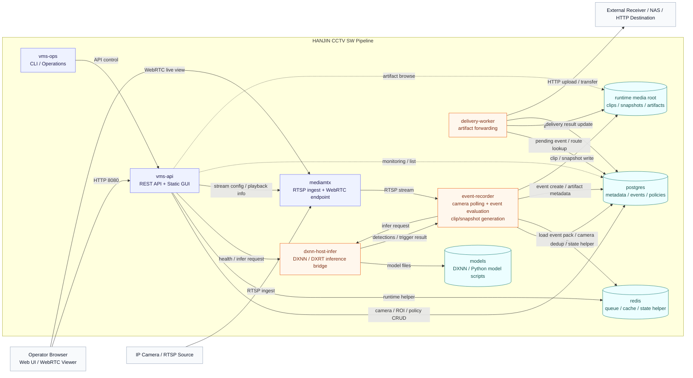

# HANJIN CCTV SW 파이프라인 구성도

이 문서는 현재 `vms-8ch-webrtc` 저장소 기준 소프트웨어 파이프라인 구성을 한 장으로 정리한 것입니다.

기준 파일:

- `README.md`
- `deploy/docker-compose.yml`
- `services/api`
- `services/recorder`
- `services/delivery`

## 파이프라인 구성도

## 흐름 요약

1. 운영자는 `vms-api`를 통해 카메라, ROI, 이벤트 정책, 전송 대상을 관리합니다.
2. 카메라 영상은 `mediamtx`로 들어오고, 브라우저는 여기서 WebRTC 라이브 뷰를 받습니다.
3. `event-recorder`는 스트림을 읽고 `dxnn-host-infer`에 추론을 요청합니다.
4. 추론 결과와 이벤트 팩 규칙을 바탕으로 Recorder가 최종 이벤트를 판정합니다.
5. 이벤트가 발생하면 Recorder가 클립/스냅샷을 `runtime media root`에 저장하고 메타데이터를 `postgres`에 기록합니다.
6. `delivery-worker`는 적재된 이벤트와 아티팩트를 읽어 외부 수신처로 전송합니다.

## 저장 위치

- Mermaid 원본: `docs/sw-pipeline/hanjin-sw-pipeline.mmd`
- 설명 문서: `docs/SW_PIPELINE_ARCHITECTURE_KO.md`
